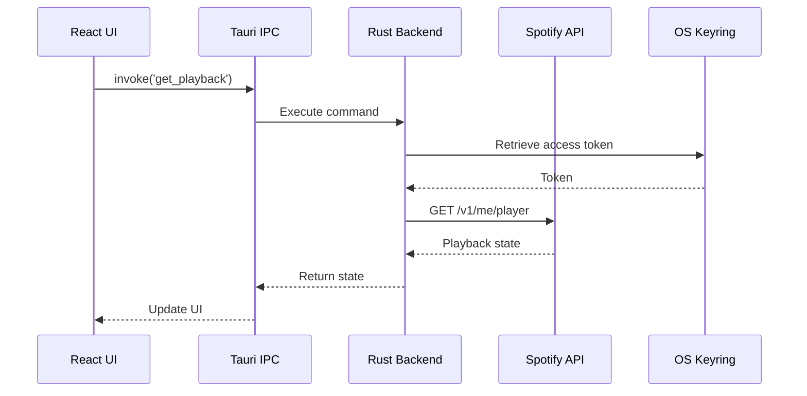

## Overview

MiniFy is a desktop mini player for Spotify built with modern web and native technologies. The application uses Tauri 2 to bridge a React 19 frontend with a Rust backend, providing a lightweight, secure, and performant experience.

## Tech Stack

### Frontend
- **React 19**: UI framework with modern concurrent features
- **Vite 7**: Lightning-fast build tool and dev server
- **Tailwind CSS 4**: Utility-first styling with the latest beta features
- **TypeScript 5.8**: Type-safe development
- **Vercel AI SDK**: Multi-provider AI integration (OpenAI, Anthropic, Google AI, Groq)

### Backend
- **Tauri 2**: Rust-powered native application framework
- **Axum**: Modern async web framework for OAuth callback server
- **Tokio**: Async runtime for concurrent operations
- **Keyring**: OS-level secure credential storage

### Monorepo Tooling
- **pnpm 9**: Fast, disk-efficient package manager
- **Turborepo 2**: High-performance build orchestration
- **Biome**: Fast linter and formatter replacing ESLint + Prettier

## Project Structure

<CodeGroup>
```bash Monorepo Layout
MiniFy/
├── apps/
│   ├── desktop/          # Tauri 2 desktop application
│   │   ├── src/          # React frontend source
│   │   ├── src-tauri/    # Rust backend source
│   │   └── package.json
│   ├── www/              # Next.js 15 landing site
│   │   ├── app/
│   │   └── package.json
│   └── docs/             # Mintlify documentation
│       └── package.json
├── packages/             # Shared libraries (future)
├── turbo.json            # Turborepo configuration
├── biome.json            # Biome linter/formatter config
└── package.json          # Root workspace config
```

```bash Desktop App Structure
apps/desktop/
├── src/                  # React frontend
│   ├── components/       # UI components
│   ├── lib/              # Utilities and helpers
│   ├── stores/           # Zustand state management
│   ├── styles/           # Tailwind CSS
│   └── main.tsx          # Application entry
├── src-tauri/            # Rust backend
│   ├── src/
│   │   ├── commands/     # Tauri command handlers
│   │   ├── main.rs       # Application entry
│   │   └── lib.rs        # Library exports
│   ├── Cargo.toml        # Rust dependencies
│   └── tauri.conf.json   # Tauri configuration
└── package.json
```
</CodeGroup>

## Architecture Diagram

<Frame>
  
</Frame>

## Core Components

### 1. Tauri Shell

The Tauri runtime provides:
- Native window management (frameless, always-on-top)
- System tray and context menus
- Inter-process communication (IPC) between frontend and backend
- Platform-specific system integrations

### 2. React Frontend

The UI layer handles:
- Player interface rendering (multiple layouts: A, B, C)
- Theme system (built-in themes + custom Theme Studio)
- Settings management
- AI DJ chat interface
- Real-time playback state updates

**State Management**:
- Zustand stores for global state (playback, settings, theme)
- React 19 concurrent features for smooth animations
- Efficient re-renders with fine-grained subscriptions

### 3. Rust Backend

The Rust layer provides secure, performant operations:

<CodeGroup>
```toml Key Dependencies
[dependencies]
tauri = { version = "2.9.3" }
tauri-plugin-opener = "2.5"
tauri-plugin-fs = "2.4"
keyring = "2"                    # Secure credential storage
axum = { version = "0.8" }        # OAuth callback server
reqwest = { version = "0.12" }    # HTTP client
tokio = { version = "1" }         # Async runtime
serde = { version = "1" }
serde_json = "1"
```
</CodeGroup>

**Rust Commands**:
- `spotify_auth`: OAuth PKCE flow implementation
- `get_credentials`: Retrieve tokens from OS keyring
- `set_credentials`: Store tokens securely
- `get_playback`: Fetch current Spotify playback state
- `control_playback`: Play, pause, skip, seek operations
- `save_settings`: Persist app configuration

### 4. Spotify Integration

<Steps>
  <Step title="OAuth Flow">
    User provides Spotify Client ID → Tauri opens PKCE authorization flow → Local callback server receives authorization code → Exchange for access/refresh tokens → Store in OS keyring
  </Step>
  
  <Step title="API Polling">
    Frontend polls Rust backend every 1-2 seconds → Backend fetches current playback from Spotify API → Returns track info, playback state, progress
  </Step>
  
  <Step title="Playback Control">
    User interacts with UI → Frontend invokes Rust command → Backend calls Spotify API → Returns updated state
  </Step>
</Steps>

### 5. AI DJ System

Powered by Vercel AI SDK with tool-calling capabilities:

<CodeGroup>
```typescript AI Providers
import { openai } from '@ai-sdk/openai';
import { anthropic } from '@ai-sdk/anthropic';
import { google } from '@ai-sdk/google';
import { groq } from '@ai-sdk/openai';

// Multi-provider support with unified interface
const providers = {
  openai: openai('gpt-4o-mini'),
  anthropic: anthropic('claude-3-haiku-20240307'),
  google: google('gemini-1.5-flash'),
  groq: groq('llama-3.1-8b-instant')
};
```
</CodeGroup>

**AI Capabilities**:
- Natural language playback control
- Music recommendation based on audio features
- Listening pattern analysis
- Context-aware conversations with tool calling

## Security Architecture

<Warning>
  All sensitive credentials are stored in OS-level secure storage. Never commit API keys or tokens to version control.
</Warning>

### Credential Storage

| Platform | Storage Backend |
|----------|----------------|
| Windows | Credential Manager |
| macOS | Keychain |
| Linux | Secret Service |

**Stored Credentials**:
- Spotify access tokens (short-lived)
- Spotify refresh tokens (long-lived)
- AI provider API keys (OpenAI, Anthropic, Google AI, Groq)
- Spotify Client ID

### OAuth PKCE Flow

<Steps>
  <Step title="Generate Code Verifier">
    Rust backend generates a cryptographically random code verifier and SHA256 challenge
  </Step>
  
  <Step title="Authorization Request">
    Opens browser with authorization URL including code challenge
  </Step>
  
  <Step title="User Authorization">
    User authorizes app on Spotify, redirected to localhost callback
  </Step>
  
  <Step title="Token Exchange">
    Backend exchanges authorization code + code verifier for tokens (prevents CSRF attacks)
  </Step>
  
  <Step title="Secure Storage">
    Access and refresh tokens stored in OS keyring, never in plain text
  </Step>
</Steps>

## Data Flow

### Playback State Updates



### Settings Persistence

<CodeGroup>
```typescript Frontend (Zustand)
// Settings stored in Zustand + persisted to disk
const useSettingsStore = create(
  persist(
    (set) => ({
      theme: 'dark',
      layout: 'A',
      aiProvider: 'openai',
      // ... other settings
    }),
    { name: 'minify-settings' }
  )
);
```

```rust Backend (Tauri)
// Settings saved to platform-specific config directory
// macOS: ~/Library/Application Support/com.minify.app/
// Windows: %APPDATA%\com.minify.app\
// Linux: ~/.config/minify/
use dirs::config_dir;
```
</CodeGroup>

## Performance Considerations

### Optimizations

<CardGroup cols={2}>
  <Card title="Efficient Polling" icon="clock">
    Spotify API polled at 1-2 second intervals, only when window is visible
  </Card>
  
  <Card title="Minimal Re-renders" icon="refresh">
    Zustand's fine-grained subscriptions prevent unnecessary React re-renders
  </Card>
  
  <Card title="Rust Performance" icon="gauge">
    Native Rust backend handles I/O operations with zero JavaScript overhead
  </Card>
  
  <Card title="Small Bundle" icon="box">
    Tauri produces significantly smaller binaries than Electron (~10-20MB vs 100MB+)
  </Card>
</CardGroup>

## Build Process

<Note>
  See [Building from Source](/developer/building) for detailed build instructions.
</Note>

The build process leverages Turborepo for optimal caching:

<Steps>
  <Step title="TypeScript Compilation">
    `tsc` validates types and generates declaration files
  </Step>
  
  <Step title="Vite Build">
    Bundles React app into optimized static assets
  </Step>
  
  <Step title="Tauri Build">
    Compiles Rust backend and packages with frontend assets into native executable
  </Step>
  
  <Step title="Platform Bundling">
    Creates platform-specific installers (DMG, MSI, AppImage, etc.)
  </Step>
</Steps>

## Development Workflow

```bash
# Install dependencies
pnpm install

# Run desktop app in dev mode
pnpm desktop:dev
# - Hot reload for React changes
# - Auto-restart for Rust changes
# - Opens frameless window with dev tools

# Run web site locally
pnpm www:dev

# Lint and format
pnpm lint
pnpm format
```

## Next Steps

<CardGroup cols={2}>
  <Card title="Building" icon="hammer" href="/developer/building">
    Learn how to build MiniFy from source
  </Card>
  
  <Card title="Contributing" icon="code-pull-request" href="/developer/contributing">
    Contribute to the MiniFy project
  </Card>
</CardGroup>
