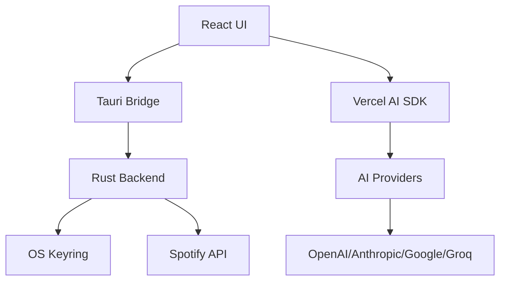

# Welcome to MiniFy

MiniFy is a lightweight Spotify mini player built with Tauri and React. It lives as a frameless desktop overlay, polls the Spotify API for your currently playing track, and gives you instant playback controls, themeable layouts, and native OS menus—all without leaving your workflow.

<CardGroup cols={2}>
  <Card title="Quick start" icon="rocket" href="/quickstart">
    Get MiniFy running in under 5 minutes
  </Card>
  <Card title="Installation" icon="download" href="/installation">
    Download and install for your platform
  </Card>
</CardGroup>

## What makes MiniFy special

MiniFy combines the convenience of a mini player with powerful features you won't find elsewhere:

### Always accessible

MiniFy floats above your other windows, giving you instant access to playback controls without switching apps. The frameless design and compact layouts (horizontal, vertical card, and minimal views) ensure it never gets in your way.

### AI-powered music discovery

Connect your preferred AI provider (OpenAI, Anthropic, Google AI, or Groq) and get intelligent music recommendations through natural conversation. Ask for "something energetic" or "songs like my recent listens" and let the AI DJ analyze your taste.

```typescript
// AI DJ uses Spotify's audio features for smart recommendations
const audioFeatures = await spotify.getAudioFeatures(trackId);
// Returns: energy, mood, tempo, danceability, acousticness, and more
```

### Secure by design

All credentials are stored in your operating system's secure credential manager—never in plain text files:

| Platform | Storage |
|----------|----------|
| Windows  | Credential Manager |
| macOS    | Keychain |
| Linux    | Secret Service |

<Note>
  MiniFy uses OAuth PKCE flow for Spotify authentication and stores all API keys (Spotify tokens, AI provider keys) in OS-level secure storage via the Rust `keyring` crate.
</Note>

## Core features

<CardGroup cols={2}>
  <Card title="Spotify integration" icon="spotify">
    Full OAuth flow with secure token storage and automatic refresh. Control playback, scrub tracks, and save to your library.
  </Card>
  <Card title="Multiple layouts" icon="grid">
    Three player layouts (A, B, C) optimized for different workflows. Switch instantly from settings.
  </Card>
  <Card title="Custom themes" icon="palette">
    Built-in themes (Dark, Light, Spotify Green, Dracula, Catppuccin) plus a Theme Studio with live JSON editor.
  </Card>
  <Card title="AI DJ" icon="robot">
    Multi-provider AI support (OpenAI, Anthropic, Google AI, Groq) with natural language control and smart recommendations.
  </Card>
</CardGroup>

## Player layouts

MiniFy offers three distinct layouts to match your workflow:

**Layout A** — Horizontal compact view with album art, track info, and playback controls in a single row. Perfect for placing at the top or bottom of your screen.

**Layout B** — Vertical card view with larger album art and stacked controls. Ideal for corner placement.

**Layout C** — Minimal view with just the essentials. Maximum screen real estate efficiency.

Switch between layouts instantly from Settings → Layout.

## Built-in themes

MiniFy ships with 8 carefully crafted themes:

<CardGroup cols={4}>
  <Card title="Catppuccin" />
  <Card title="Dark" />
  <Card title="Dracula" />
  <Card title="Light" />
  <Card title="BMW" />
  <Card title="YouTube" />
  <Card title="Milka" />
  <Card title="ChatGPT" />
</CardGroup>

### Theme Studio

Create your own themes with the built-in JSON editor. Full control over:

- Panel background, border radius, and shadows
- Control icon colors and hover states
- Playback bar styling (track background, fill gradient, thumb)
- Typography (song title, artist colors and weights)
- Action button styling
- Album cover borders and radius

```json
{
  "name": "my-custom-theme",
  "panel": {
    "background": "rgba(18, 18, 18, 0.85)",
    "borderRadius": 18,
    "shadow": "0 14px 36px rgba(0, 0, 0, 0.65)"
  },
  "controls": {
    "iconColor": "#E5E5E5",
    "iconColorActive": "#FFFFFF"
  }
}
```

Export and share your themes as JSON files.

## AI DJ features

The AI DJ analyzes your listening history and provides intelligent recommendations:

<Steps>
  <Step title="Connect your AI provider">
    Add your API key for OpenAI, Anthropic, Google AI, or Groq in Settings → AI DJ.
  </Step>
  <Step title="Start a conversation">
    Open the AI DJ chat and describe what you want to listen to in natural language.
  </Step>
  <Step title="Get smart recommendations">
    The AI analyzes your last 30 tracks, top artists, and Spotify's audio features (energy, mood, tempo, danceability) to suggest perfect matches.
  </Step>
  <Step title="Auto-queue mode">
    Enable AI Queue to automatically generate endless playlists. When 2 tracks remain, the next batch is fetched automatically.
  </Step>
</Steps>

<Warning>
  AI Queue uses your configured AI provider's API and will consume tokens. A red border appears when active as a visual reminder. Configure this in Settings → AI DJ.
</Warning>

### Supported AI providers

- **OpenAI** — GPT-4o Mini
- **Anthropic** — Claude 3 Haiku  
- **Google AI** — Gemini 1.5 Flash
- **Groq** — Llama 3.1 8B

## Tech stack

MiniFy is built with modern, performant technologies:

- **Desktop**: Tauri 2, React 19, Vite 7, Tailwind CSS 4
- **Backend**: Rust with Tauri commands for OAuth, secure keyring storage, and Spotify API calls
- **AI**: Vercel AI SDK with tool calling for Spotify integration
- **API**: Spotify Web API with OAuth PKCE flow

## Architecture



All credentials (Spotify tokens, AI API keys) are stored in your OS-level secure keyring. The React UI communicates with Rust backend commands via Tauri's IPC bridge. AI DJ uses the Vercel AI SDK with tool-calling to integrate with Spotify playback.

## Ready to get started?

<CardGroup cols={2}>
  <Card title="Install MiniFy" icon="download" href="/installation">
    Download for Windows, macOS, or Linux
  </Card>
  <Card title="Quick start guide" icon="play" href="/quickstart">
    Connect Spotify and play your first track
  </Card>
</CardGroup>
